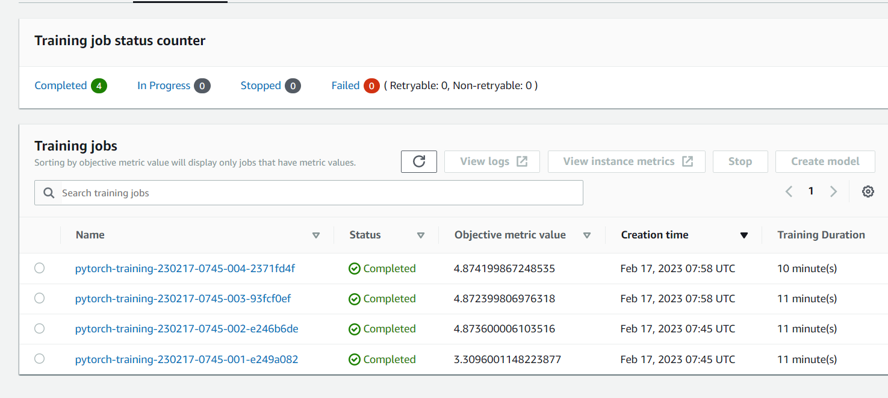
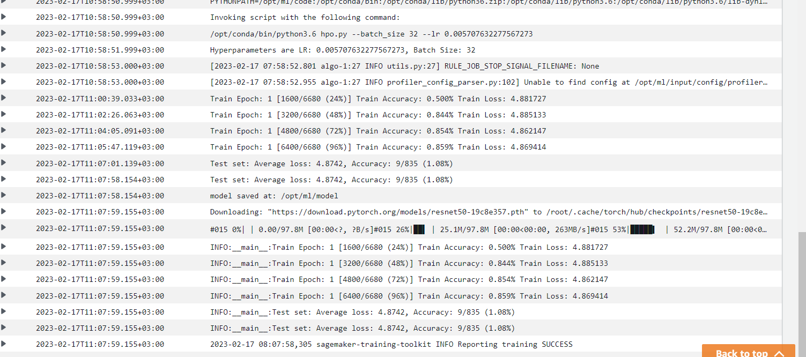
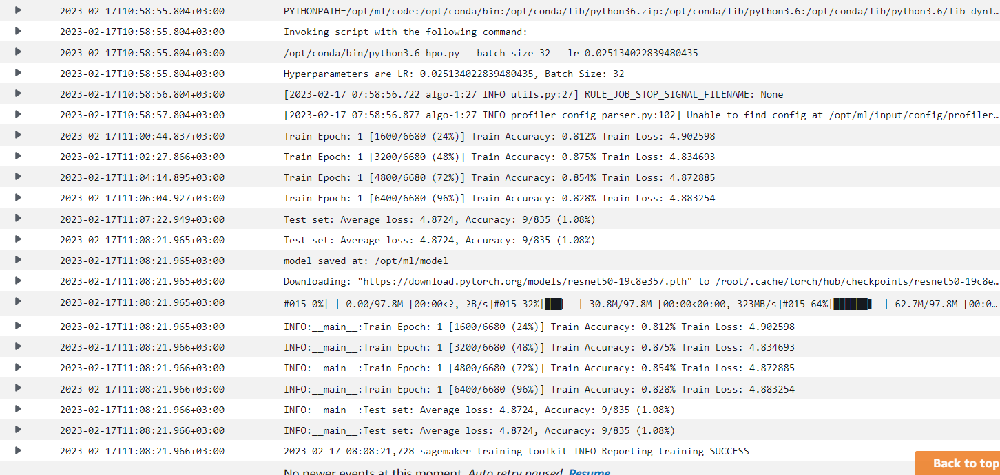
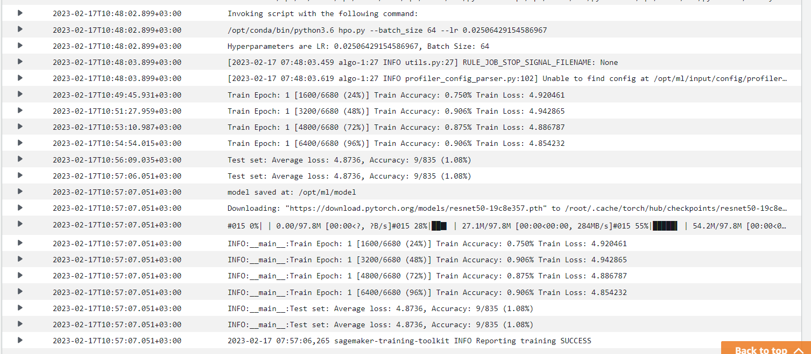
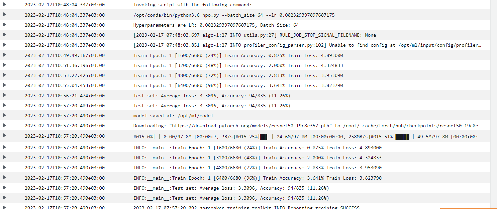
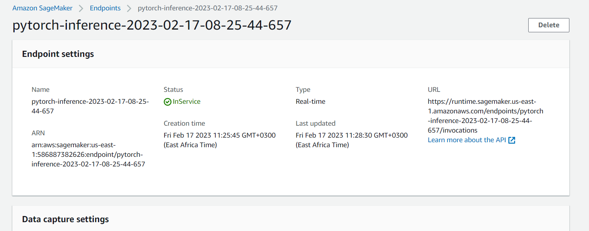

# Image Classification using AWS SageMaker

Use AWS Sagemaker to train a pretrained model that can perform image classification by using the Sagemaker profiling, debugger, hyperparameter tuning and other good ML engineering practices. This can be done on either the provided dog breed classication data set or one of your choice.

## Project Set Up and Installation
Enter AWS through the gateway in the course and open SageMaker Studio. 
Download the starter files.
Download/Make the dataset available. 
## EXPLANATION OF THE USED FILES

hpo.py containes the code for running the hyper parameter tuning jobs.
train_model.py containes the code for training and profiling/debugging.
inference2.py is a separate script for the model entrypoint for the deployement.

## Dataset
The provided dataset is the dogbreed classification dataset which can be found in the classroom.
The project is designed to be dataset independent so if there is a dataset that is more interesting or relevant to your work, you are welcome to use it to complete the project.

### Access
Upload the data to an S3 bucket through the AWS Gateway so that SageMaker has access to the data. 

## Hyperparameter Tuning
What kind of model did you choose for this experiment and why? Give an overview of the types of parameters and their ranges used for the hyperparameter search

Remember that your README should:
- Include a screenshot of completed training jobs

- Logs metrics during the training process




- Tune at least two hyperparameters
- Retrieve the best best hyperparameters from all your training jobs

## Debugging and Profiling
**TODO**: Give an overview of how you performed model debugging and profiling in Sagemaker
I made the debugging and profiling to look for issuers during the training process. The debugger and the profiler have looked for the following issues and reported the finding. The issues include overtraining, loss_not_decreasing, poor_weight_initialization, ProfilerReport, CPUBottleneck, OverallSystemUsage.

### Results
**TODO**: What are the results/insights did you get by profiling/debugging your model?
I made the profiling and debugging to look for many issues. The debugger found that there is a PoorWeightInitialization problem. 
**TODO** Remember to provide the profiler html/pdf file in your submission.


## Model Deployment
**TODO**: Give an overview of the deployed model and instructions on how to query the endpoint with a sample input.
The model has been deployed, it will classify among the 133 dog classes. setting the path of the image to image_path will be enough to obtain the prediction from the endpoint.
**TODO** Remember to provide a screenshot of the deployed active endpoint in Sagemaker.


## Standout Suggestions
**TODO (Optional):** This is where you can provide information about any standout suggestions that you have attempted.


```python

```
